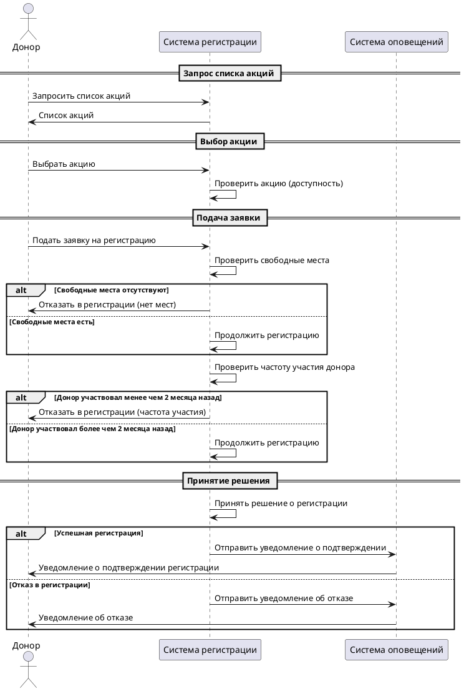
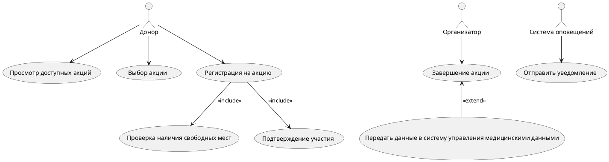

---
Sequence diagram
---

```plantuml

@startuml

actor Донор

participant "Система регистрации" as RegistrationSystem

participant "Система оповещений" as NotificationSystem

== Запрос списка акций ==

Донор -> RegistrationSystem: Запросить список акций

RegistrationSystem -> Донор: Список акций

== Выбор акции ==

Донор -> RegistrationSystem: Выбрать акцию

RegistrationSystem -> RegistrationSystem: Проверить акцию (доступность)

== Подача заявки ==

Донор -> RegistrationSystem: Подать заявку на регистрацию

RegistrationSystem -> RegistrationSystem: Проверить свободные места

alt Свободные места отсутствуют

RegistrationSystem -> Донор: Отказать в регистрации (нет мест)

else Свободные места есть

RegistrationSystem -> RegistrationSystem: Продолжить регистрацию

end

RegistrationSystem -> RegistrationSystem: Проверить частоту участия донора

alt Донор участвовал менее чем 2 месяца назад

RegistrationSystem -> Донор: Отказать в регистрации (частота участия)

else Донор участвовал более чем 2 месяца назад

RegistrationSystem -> RegistrationSystem: Продолжить регистрацию

end

== Принятие решения ==

RegistrationSystem -> RegistrationSystem: Принять решение о регистрации

alt Успешная регистрация

RegistrationSystem -> NotificationSystem: Отправить уведомление о подтверждении

NotificationSystem -> Донор: Уведомление о подтверждении регистрации

else Отказ в регистрации

RegistrationSystem -> NotificationSystem: Отправить уведомление об отказе

NotificationSystem -> Донор: Уведомление об отказе

end

@enduml

```
---
Use case diagram
---

```plantuml
@startuml

actor Донор

actor Организатор

actor "Система оповещений" as SMS

Донор --> (Просмотр доступных акций)

Донор --> (Выбор акции)

Донор --> (Регистрация на акцию)

Организатор --> (Завершение акции)

(SMS) --> (Отправить уведомление)

(Регистрация на акцию) --> (Проверка наличия свободных мест) : <<include>>
(Регистрация на акцию) --> (Подтверждение участия) : <<include>>

(Завершение акции) <-- (Передать данные в систему управления медицинскими данными) : <<extend>>
@enduml

```